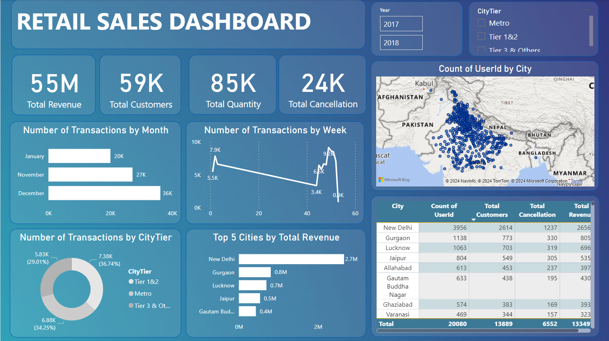

# Power-BI-Projects

Welcome to the Sales analysis of retail data project! This repository contains the code and resources used to create a comprehensive analysis of sales of retail data using Power BI.
This dashboard provides visual highlights and key performance indicators for retail sales data, including total revenue, customers, quantity, cancellations, and transactions by month, week, and city tier.

